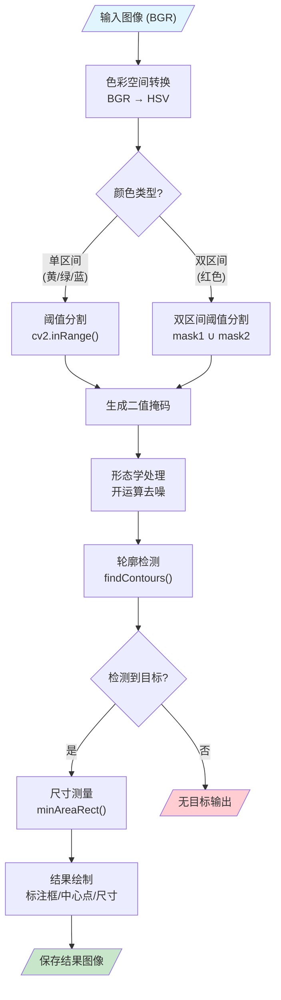
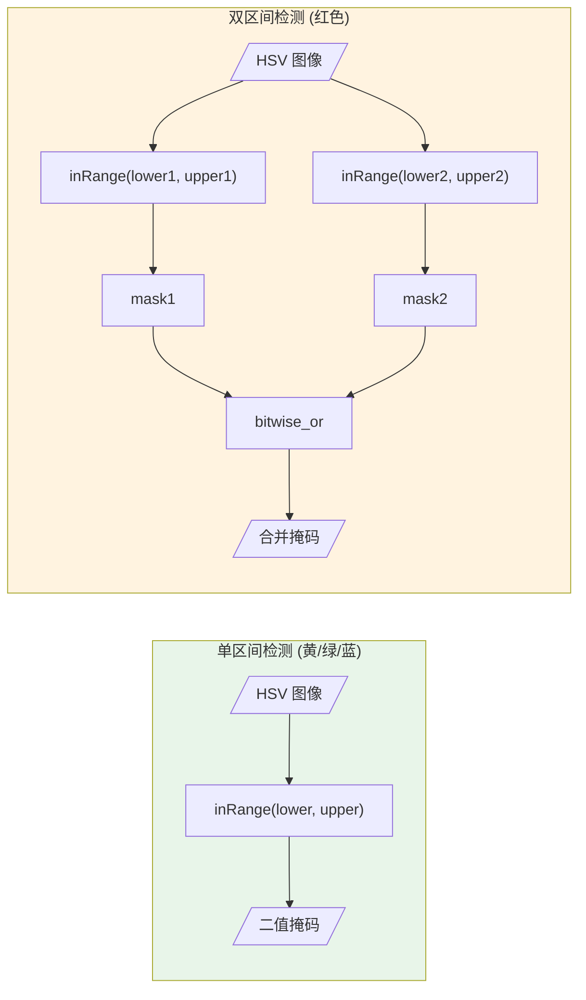
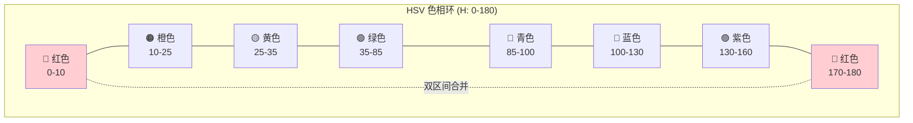

# 基于海康工业相机的颜色检测实验

## 1. 实验目的

1. **掌握工业相机的基本操作**：学习海康威视工业相机的连接、配置和图像采集方法
2. **理解 HSV 色彩空间原理**：掌握 HSV 色彩空间与 RGB 的区别，理解其在颜色检测中的优势
3. **掌握颜色检测算法**：学习基于阈值分割的颜色检测方法，包括单区间和双区间检测
4. **学习图像处理流程**：掌握形态学处理、轮廓检测、尺寸测量等图像处理技术
5. **培养工程实践能力**：通过 GUI 参数调试，学习实际工程中的参数标定方法

## 2. 实验设备

### 2.1 硬件设备

| 设备名称 | 规格要求 | 数量 | 备注 |
|---------|---------|------|------|
| 海康威视工业相机 | GigE 或 USB 接口 | 1 台 | 推荐型号：MV-CE013-50GC 等 |
| 计算机 | Windows 10/11 系统 | 1 台 | 推荐配置：8GB+ 内存 |
| 网线/USB 线 | 与相机接口匹配 | 1 根 | GigE 相机需 CAT5e 以上网线 |
| 光源 | 可调亮度 LED 光源 | 1 套 | 可选，用于稳定光照环境 |
| 测试样品 | 黄色/红色物体 | 若干 | 用于颜色检测测试 |
| 标定板 | 已知尺寸的参照物 | 1 个 | 用于像素-毫米转换标定 |

### 2.2 软件环境

| 软件名称 | 版本要求 | 用途 |
|---------|---------|------|
| Python | ≥ 3.8 | 运行环境 |
| OpenCV | ≥ 4.8.1.78 | 图像处理 |
| NumPy | 1.24 | 数值计算 |
| PyYAML | ≥ 6.0.3 | 配置文件解析 |
| Pillow | ≥ 10.4.0 | 图像 I/O |
| 海康 MVS 软件 | 最新版本 | 相机驱动和调试 |

### 2.3 项目文件结构

```
ExperimentalCase/
├── common/                  # 公共模块
│   ├── Camera.py           # 海康相机驱动封装
│   ├── MvImport/           # 海康 SDK Python 接口
│   └── dll/                # 海康 SDK DLL 文件
├── exp_1/                  # 实验目录
│   ├── main.py            # 命令行版本
│   ├── main_gui.py        # GUI 图形界面版本
│   ├── config.yaml        # 颜色识别参数配置
│   └── saved_images/      # 保存的检测结果
```

## 3. 实验原理

### 3.1 HSV 色彩空间

HSV（Hue, Saturation, Value）是一种基于人类视觉感知的色彩空间，由三个分量组成：

| 分量 | 中文名 | OpenCV 范围 | 说明 |
|------|-------|------------|------|
| H | 色相 | 0-180 | 表示颜色种类（红、黄、绿等） |
| S | 饱和度 | 0-255 | 表示颜色纯度（0=灰色，255=纯色） |
| V | 亮度 | 0-255 | 表示明暗程度（0=黑色，255=最亮） |

**HSV 色相环示意图：**

```
        红色 (0°/180°)
           ↑
    品红 ←   → 黄色 (30°)
           |
    蓝色 ←   → 绿色 (60°)
           ↓
        青色 (90°)
```

**HSV 相比 RGB 的优势：**
- RGB 对光照变化敏感，相同颜色在不同光照下 RGB 值差异大
- HSV 中 H 通道主要反映颜色种类，受光照影响较小
- 通过调整 S 和 V 范围，可过滤白色背景（低 S）和黑色阴影（低 V）

### 3.2 颜色检测原理

颜色检测基于**阈值分割**原理，核心步骤如下：



**阈值分割公式：**

$$
mask(x,y) = 
\begin{cases}
255 & \text{if } lower \leq pixel(x,y) \leq upper \\
0 & \text{otherwise}
\end{cases}
$$

### 3.3 单区间与双区间检测



**单区间检测（适用于黄色、绿色、蓝色等）：**

```python
mask = cv2.inRange(hsv, lower, upper)
```

**双区间检测（适用于红色）：**

红色在 HSV 色相环中跨越 H=0°/180° 边界，需要两个区间：
- 区间 1: H ∈ [0, 10]（接近 0°）
- 区间 2: H ∈ [170, 180]（接近 180°）

```python
mask1 = cv2.inRange(hsv, lower1, upper1)  # 区间 1
mask2 = cv2.inRange(hsv, lower2, upper2)  # 区间 2
mask = cv2.bitwise_or(mask1, mask2)       # 合并
```

**HSV 色相环与红色区间示意：**



### 3.4 形态学处理

**开运算（MORPH_OPEN）** = 先腐蚀后膨胀

- **作用**：去除小的噪点和毛刺，同时保持目标形状

- **数学表示**：
  $$
  A \circ B = (A \ominus B) \oplus B
  $$
  

```python
kernel = np.ones((5, 5), np.uint8)
mask = cv2.morphologyEx(mask, cv2.MORPH_OPEN, kernel)
```

### 3.5 尺寸测量原理

**像素到实际尺寸的转换：**

$$
L_{real} = \frac{L_{pixel}}{k}
$$

其中 k 为标定系数（pixels_per_mm），表示每毫米对应的像素数。

**标定方法：**

1. 拍摄已知尺寸的参照物

2. 在图像上测量参照物的像素长度

3. 计算：
   $$
   k = \frac{L_{pixel}}{L_{real}}
   $$
   

## 4. 实验步骤

### 4.1 实验准备

#### 步骤 1：安装依赖

```bash
# 进入项目目录
cd ExperimentalCase

# 方式一：使用 uv（推荐）
uv sync

# 方式二：使用 pip
pip install -r requirements.txt
```

#### 步骤 2：连接相机

1. 将海康相机通过网线（GigE）或 USB 线连接到计算机
2. 打开海康 MVS 软件，确认相机被正确识别
3. 在 MVS 中测试取图，确保相机工作正常
4. 关闭 MVS 软件（避免与 Python 程序冲突）

#### 步骤 3：准备测试环境

1. 放置光源，确保光照均匀稳定
2. 准备黄色和红色测试样品
3. 调整相机位置和焦距，确保图像清晰

### 4.2 运行 GUI 程序

#### 步骤 4：启动程序

```bash
cd exp_1
uv run python main_gui.py
# 或
python main_gui.py
```

程序启动后显示三个功能页面：
- **智能识别**：执行颜色检测
- **参数调试**：调整 HSV 参数
- **尺寸标定**：标定像素-毫米转换系数

### 4.3 参数调试实验

#### 步骤 5：进入参数调试页面

1. 点击左侧导航栏"⚙️ 参数调试"
2. 点击"📸 重新抓拍图像"获取当前画面
3. 界面显示原始图像和处理结果预览

#### 步骤 6：调整 HSV 参数

1. **调整 H（色相）范围**：
   - H Min：目标颜色的最小色相值
   - H Max：目标颜色的最大色相值
   - 参考值：黄色 20-35，绿色 35-85，蓝色 100-130

2. **调整 S（饱和度）范围**：
   - S Min：调高可过滤白色/灰色背景
   - S Max：通常设为 255

3. **调整 V（亮度）范围**：
   - V Min：调高可过滤黑色/阴影
   - V Max：通常设为 255

4. **实时预览**：调整滑块时，右侧实时显示处理效果

#### 步骤 7：获取精确 HSV 值

1. 在原始图像上点击目标颜色区域
2. 程序显示该像素的精确 HSV 值
3. 以此为参考设置 HSV 范围（通常 ±10-20）

#### 步骤 8：保存参数

1. 在"保存至配置文件"下拉框选择目标颜色
2. 点击"💾 保存参数"保存到配置文件
3. 或点击"➕ 添加新颜色"创建新的颜色配置

### 4.4 尺寸标定实验

#### 步骤 9：进入尺寸标定页面

1. 点击左侧导航栏"📏 尺寸标定"
2. 放置已知尺寸的标定物体（如 50mm 的标尺）

#### 步骤 10：执行标定

1. 点击"📸 重新抓拍图像"
2. 在图像上点击标定物体的两个端点
3. 程序显示两点间的像素距离
4. 在输入框中输入实际距离（mm）
5. 点击"计算标定系数"
6. 保存标定结果

### 4.5 颜色检测实验

#### 步骤 11：进入智能识别页面

1. 点击左侧导航栏"🔍 智能识别"
2. 确认相机连接状态显示"已连接"

#### 步骤 12：执行颜色检测

1. 放置目标颜色物体（黄色或红色）
2. 点击对应的检测按钮（如"检测 YELLOW"）
3. 程序执行检测并显示结果：
   - 在图像上绘制检测框和中心点
   - 显示目标的尺寸信息
   - 显示中心坐标 (cx, cy)

#### 步骤 13：查看保存结果

检测结果自动保存到：
```
exp_1/saved_images/
├── yellow_results/    # 黄色检测结果
└── red_results/       # 红色检测结果
```

### 4.6 命令行模式实验（可选）

#### 步骤 14：运行命令行版本

```bash
cd exp_1
uv run python main.py
# 或
python main.py
```

命令行版本执行单次检测并输出结果：
```
检测结果:
- 颜色: YELLOW
- 中心坐标: (320, 240)
- 尺寸: 45.2mm x 32.1mm
- 保存路径: saved_images/yellow_results/yellow.jpg
```

## 5. 实验记录表

| 实验项目 | 参数/结果 | 备注 |
|---------|----------|------|
| 相机型号 | | |
| 镜头焦距 | | mm |
| 工作距离 | | mm |
| 光源类型 | | |
| 黄色 HSV 范围 | H:__-__, S:__-__, V:__-__ | |
| 红色 HSV 范围 | 区间1: H:__-__, S:__-__, V:__-__ | |
| | 区间2: H:__-__, S:__-__, V:__-__ | |
| 标定系数 | | pixels/mm |
| 检测准确率 | | % |

## 6. 思考题

1. **为什么红色检测需要使用双区间，而黄色不需要？**

2. **如果检测环境光照发生变化，应该如何调整 HSV 参数？主要调整哪个分量？**

3. **形态学开运算中，核大小如何影响检测效果？核太大或太小会有什么问题？**

4. **如何提高颜色检测的鲁棒性，减少光照变化的影响？**

5. **在实际工业应用中，除了颜色检测，还可以通过哪些特征来识别目标物体？**

## 7. 参考资料

1. OpenCV 官方文档：https://docs.opencv.org/
2. 海康威视 MVS 用户手册
3. 《数字图像处理》- 冈萨雷斯
4. HSV 色彩空间：https://en.wikipedia.org/wiki/HSL_and_HSV
